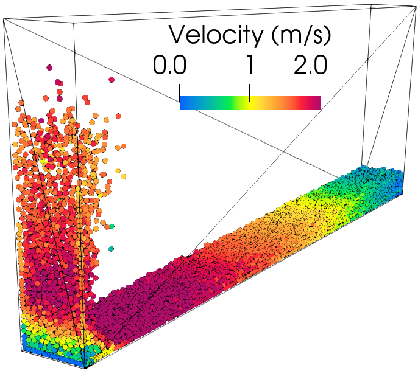
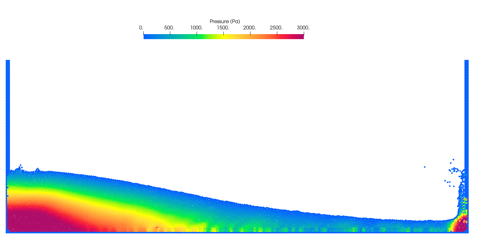
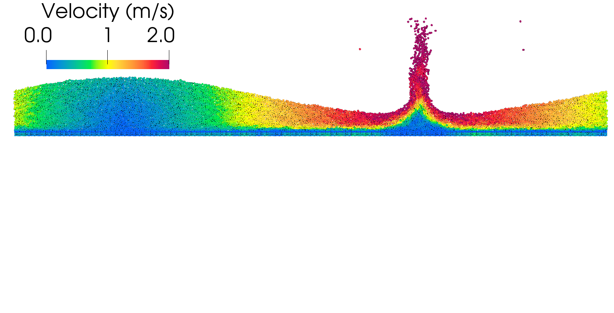
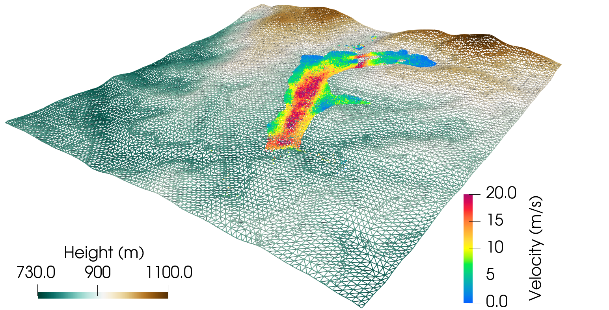

### :warning:FIRST, go to the directory [**input/grid**](https://github.com/rubensamarojr/polymps/tree/master/input/grid) and extract the compressed folder [**grid.zip**](https://github.com/rubensamarojr/polymps/blob/master/input/grid/grid.zip) in your grid directory.
 

# Examples

## Dam break (Lobovský)

Newtonian Dam break simulation.

**Reference:** [Lobovský et al. 2014. Experimental investigation of dynamic pressure loads during dam break](https://doi.org/10.1016/j.jfluidstructs.2014.03.009)

### MpsInputExample.json

3D Polygon-based wall and weakly-compressible MPS.

### InputDamINC.json

3D Polygon-based wall and incompressible MPS.

### InputDamWC.json

3D Polygon-based wall and weakly-compressible MPS.

### dam1610_h300_lo0p0050_INC.json

2D Particle-based wall and incompressible MPS.

### dam1610_h300_lo0p0050_WC.json

2D Particle-based wall and weakly-compressible MPS.
 

## Dam break

Newtonian Dam break simulation.

**No Reference**

### InputDamWall_INC.json

2D Particle-based wall and incompressible MPS.
 

## Periodic boundary condition (BC)

Newtonian Dam break with periodic boundary (BC) condition.

**No Reference**

### dam1610_BC.json

2D Particle-based wall and weakly-compressible MPS.

 

## Tailings Dam (Brumadinho)

Newtonian Brumadinho Tailings Dam Failure simulation.

**Reference:** [Amaro Jr et al. 2019. Polygon Wall Boundary Model in Particle-Based Method: Application To Brumadinho Tailings Dam Failure](https://www.researchgate.net/publication/336852676_POLYGON_WALL_BOUNDARY_MODEL_IN_PARTICLE-BASED_METHOD_APPLICATION_TO_BRUMADINHO_TAILINGS_DAM_FAILURE)

### BRUMADINHO_space10_lo10p00.json

3D Polygon-based wall and weakly-compressible MPS.

 

## Non-Newtonian (Fraccarollo)

Non-Newtonian Dam break simulation.

**Reference:** [Fraccarollo et al. 2002. Riemann wave description of erosional dam-break flows.](https://doi.org/10.1017/S0022112002008455)

### 2D_dam_fraccarollo_lo02p50e-03_INC.json

2D Particle-based wall and incompressible MPS.

### 2D_dam_fraccarollo_lo02p50e-03_WC.json

2D Particle-based wall and weakly-compressible MPS.

### subaerial_2D_lo08p00e-04_INC.json

2D Particle-based wall and incompressible MPS.

### damErosion3D_WC.json

3D Polygon-based wall and weakly-compressible MPS.
 

## Non-Newtonian (Nodoushan)

Non-Newtonian Dam break simulation.

**Reference:** [Nodoushan et al. 2018. A multiphase meshfree particle method for continuum-based modeling of dry and submerged granular flows.](https://doi.org/10.1016/j.powtec.2018.04.071)

### S1_2D_lo08p00e-04_INC.json

2D Particle-based wall and incompressible MPS.

### subaquatic_2D_lo08p00e-04_INC.json

2D Particle-based wall and incompressible MPS.

### subaquatic_2D_lo08p00e-04_WC.json

2D Particle-based wall and weakly-compressible MPS.

